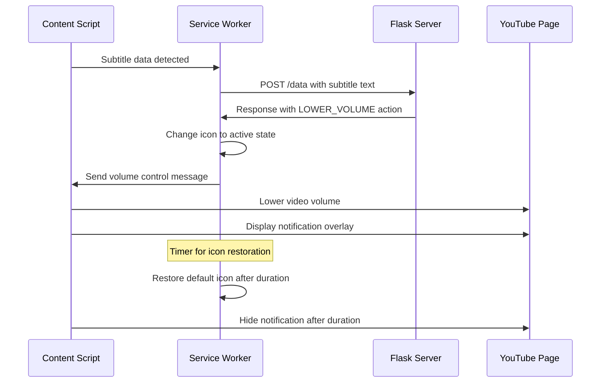

# Design Document: Chrome Extension Visual Feedback

## Overview

This design document outlines the implementation approach for adding visual feedback capabilities to Project Crest's Chrome extension. The solution enhances user experience by providing clear visual indicators when the AI agent detects loud audio events and manages volume, building trust and awareness of the system's intelligent behavior.

## Architecture

### Component Interaction Flow



### File Structure Enhancement

```
chrome-extension/
├── manifest.json           # Updated with popup, icons and web resources
├── service-worker.js       # Enhanced with icon management
├── content-script.js       # Enhanced with notification display and CSS injection
├── popup.html              # New: Agent control panel interface
├── popup.css               # New: Popup styling
├── popup.js                # New: Popup interaction logic
├── notification.css        # New: Notification styling
└── icons/                  # New: Icon assets directory
    ├── icon-default.png    # Grey state (128x128)
    └── icon-active.png     # Blue/orange active state (128x128)
```

## Components and Interfaces

### 1. Manifest Configuration

**Purpose**: Configure extension permissions, icons, and web-accessible resources

**Key Changes**:
- Add `action.default_icon` for toolbar icon
- Add `icons` section for extension icon
- Add `web_accessible_resources` for notification.css
- Maintain existing permissions and host permissions

**Interface**:
```json
{
  "manifest_version": 3,
  "name": "Project Crest",
  "version": "1.0",
  "description": "AI-powered volume control for YouTube videos. Automatically detects loud audio events from subtitles and preemptively adjusts volume for a consistent listening experience.",
  "action": {
    "default_title": "Crest",
    "default_popup": "popup.html",
    "default_icon": { "128": "icons/icon-default.png" }
  },
  "icons": { "128": "icons/icon-default.png" },
  "web_accessible_resources": [{
    "resources": ["notification.css"],
    "matches": ["*://*.youtube.com/*"]
  }]
}
```

### 2. Service Worker Enhancement

**Purpose**: Coordinate icon state changes with volume control actions

**Key Enhancements**:
- Icon state management using `chrome.action.setIcon()`
- Timer-based icon restoration
- Tab-specific icon changes

**Interface**:
```javascript
// Icon management methods
chrome.action.setIcon({ path: "icons/icon-active.png", tabId: tabId });
setTimeout(() => {
  chrome.action.setIcon({ path: "icons/icon-default.png", tabId: tabId });
}, duration + 500);
```

### 3. Content Script Enhancement

**Purpose**: Display on-screen notifications and manage notification lifecycle

**Key Enhancements**:
- Create persistent notification DOM element
- Show/hide notifications with smooth transitions
- Coordinate notification timing with volume adjustments

**Interface**:
```javascript
// Notification management with CSS injection
const notification = document.createElement('div');
notification.id = 'crest-notification';
document.body.appendChild(notification);

const link = document.createElement('link');
link.rel = 'stylesheet';
link.href = chrome.runtime.getURL('notification.css');
document.head.appendChild(link);

notification.textContent = '🔉 Crest: Volume Lowered';
notification.style.opacity = 1; // Show
notification.style.opacity = 0; // Hide
```

### 4. Popup Interface System

**Purpose**: Provide agent control panel for monitoring and status display

**Key Components**:
- HTML structure with status display, settings controls, and log container
- CSS styling for consistent branding and layout
- JavaScript for popup interaction, settings management, and event handling
- 300px width with settings section and scrollable log area (120px height)
- Settings controls for notification toggle and volume level adjustment

**Interface**:
```html
<body>
  <h3>Crest Agent</h3>
  <p>Status: <span id="status">Active</span></p>
  
  <!-- Settings Controls -->
  <div id="settings-section">
    <label>
      <input type="checkbox" id="enable-notifications" checked> 
      Show notifications
    </label>
    <label>
      Volume reduction: <input type="range" id="volume-level" min="0.1" max="0.8" value="0.3" step="0.1">
      <span id="volume-display">30%</span>
    </label>
  </div>
  
  <div id="log-container"><p>Waiting for events...</p></div>
</body>
```

**Icon Assets Organization**:
- **Directory**: Create `chrome-extension/icons/` folder
- **File Names**: 
  - `chrome-extension/icons/icon-default.png` - Grey/inactive state (128x128px)
  - `chrome-extension/icons/icon-active.png` - Blue/orange active state (128x128px)
- **File Format**: PNG with transparent backgrounds
- **Naming Convention**: Use descriptive names that clearly indicate state
- **Alternative Names** (if preferred):
  - `chrome-extension/icons/crest-inactive.png`
  - `chrome-extension/icons/crest-active.png`
- Icons will be referenced in both `action.default_icon` and `icons` manifest sections

### 5. Enhanced Notification System

**Purpose**: Provide consistent, non-intrusive visual styling with dynamic CSS injection

**Key Features**:
- Semi-transparent dark background (rgba(0, 0, 0, 0.8))
- Fixed positioning (top-right corner)
- Smooth opacity transitions (0.5s)
- High z-index for visibility (9999)
- Dynamic CSS injection using chrome.runtime.getURL

## Data Models

### Icon State Model
```javascript
const IconState = {
  DEFAULT: "icons/icon-default.png",  // Grey icon for inactive state
  ACTIVE: "icons/icon-active.png"     // Green icon for active volume control
};
```

### Notification Configuration
```javascript
const NotificationConfig = {
  position: { top: "20px", right: "20px" },
  styling: {
    backgroundColor: "rgba(0, 0, 0, 0.8)",
    color: "white",
    padding: "10px 20px",
    borderRadius: "5px",
    zIndex: 9999
  },
  animation: {
    transitionDuration: "0.5s",
    property: "opacity"
  }
};
```

### Message Protocol Extension
```javascript
// Existing message enhanced with visual feedback timing
const VolumeControlMessage = {
  action: "LOWER_VOLUME",
  level: 0.3,           // Volume level (0.0 - 1.0)
  duration: 2000,       // Duration in milliseconds
  // Visual feedback uses same duration for consistency
};
```

## Error Handling

### Icon Management Errors
- **Missing Icon Files**: Graceful fallback to browser default icon
- **Permission Errors**: Log error but continue with volume control functionality
- **Tab Context Errors**: Validate tab existence before icon operations

### Notification Display Errors
- **DOM Injection Failures**: Retry notification creation with fallback positioning
- **CSS Loading Failures**: Inline critical styles as fallback
- **Multiple Notification Conflicts**: Use single notification element with content updates

### Resource Loading Errors
- **Icon Asset Loading**: Provide base64 encoded fallback icons
- **CSS Resource Access**: Inline critical notification styles in content script
- **Timing Synchronization**: Use robust setTimeout with error boundaries

## Testing Strategy

### Unit Testing Approach
- **Icon State Management**: Mock chrome.action.setIcon calls and verify correct paths
- **Notification DOM Manipulation**: Test element creation, styling, and cleanup
- **Message Handling**: Verify visual feedback triggers on correct message types
- **Timing Coordination**: Test icon restoration and notification hiding timers

### Integration Testing Scenarios
1. **End-to-End Visual Flow**: Subtitle detection → AI analysis → volume control → visual feedback
2. **Multi-Tab Behavior**: Verify tab-specific icon changes don't interfere
3. **Rapid Event Handling**: Test visual feedback with multiple quick loud events
4. **Error Recovery**: Test graceful degradation when visual assets fail to load

### Manual Testing Checklist
- [ ] Extension icon changes from grey to green during volume control
- [ ] Icon returns to grey after volume adjustment period
- [ ] On-screen notification appears with volume lowering
- [ ] Notification fades out smoothly after adjustment period
- [ ] Visual feedback works across different YouTube video types
- [ ] No visual conflicts with YouTube's native UI elements
- [ ] Proper behavior when switching between multiple YouTube tabs

### Performance Considerations
- **Icon Change Latency**: Target <100ms from AI decision to visual feedback
- **Memory Usage**: Single notification element reuse to prevent DOM bloat
- **CSS Animation Performance**: Use opacity transitions for hardware acceleration
- **Resource Cleanup**: Proper timer cleanup to prevent memory leaks