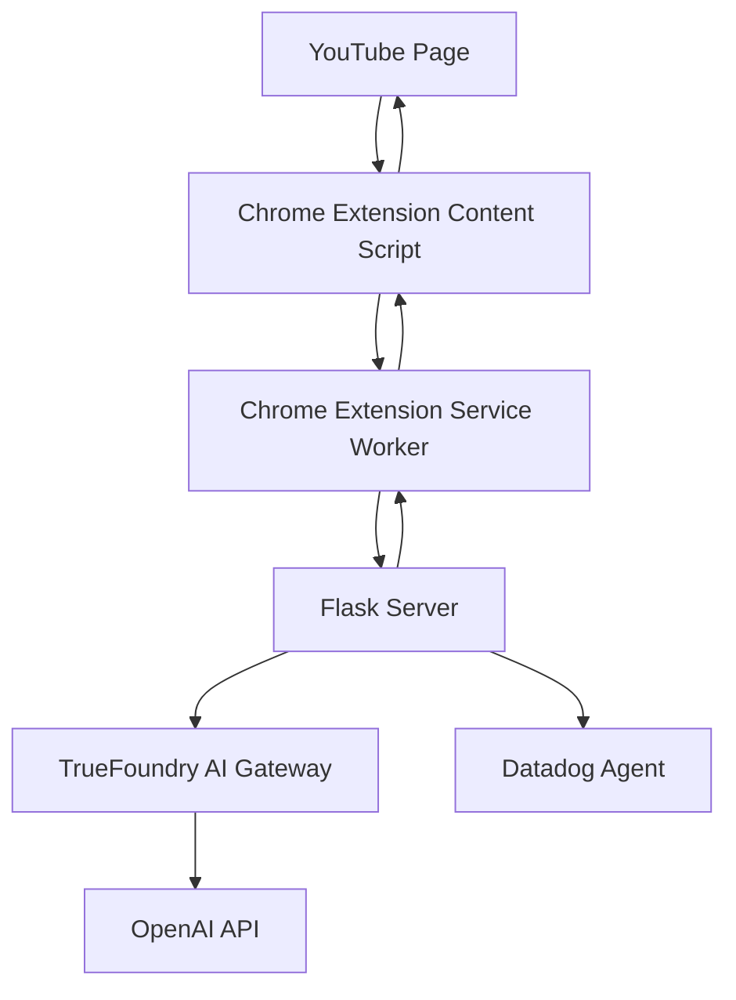

# Design Document: Project Crest (Hackathon MVP)

## Overview

Project Crest is an AI-powered browser agent that automatically adjusts YouTube video volume based on subtitle content analysis. The system consists of a Chrome extension that monitors YouTube subtitles and a Flask server that uses AI to detect loud events and send volume adjustment commands back to the browser.

## Architecture



### Component Flow
1. **Content Script** monitors YouTube subtitle changes via DOM observation
2. **Service Worker** receives subtitle text and forwards to Flask server
3. **Flask Server** processes text through TrueFoundry → OpenAI for loud event detection
4. **Server Response** sends volume adjustment command back to extension
5. **Extension** modifies video element volume and restores after timeout

## Components and Interfaces

### Chrome Extension

#### Content Script (`content-script.js`)
- **Purpose**: Monitor YouTube subtitles and control video volume
- **Key Functions**:
  - `observeSubtitles()`: Uses MutationObserver to watch `.ytp-caption-segment` elements
  - `sendSubtitleText(text)`: Sends captured text to service worker
  - `adjustVolume(level, duration)`: Modifies HTML5 video element volume
  - `restoreVolume()`: Returns volume to original level after timeout

#### Service Worker (`service-worker.js`)
- **Purpose**: Coordinate between content script and Flask server
- **Key Functions**:
  - `onMessage()`: Receives subtitle text from content script
  - `sendToServer(data)`: Makes HTTP POST to `http://localhost:5000/data`
  - `handleServerResponse()`: Processes volume adjustment commands
  - `injectContentScript()`: Injects content script on YouTube navigation

#### Manifest (`manifest.json`)
- **Permissions**: `scripting`, `webNavigation`
- **Host Permissions**: `*://*.youtube.com/*`, `http://localhost:5000/*`
- **Background**: Service worker registration

### Flask Server

#### Main Application (`app.py`)
- **Framework**: Flask with CORS enabled for Chrome extension origin
- **Endpoints**:
  - `POST /data`: Receives subtitle text, processes via AI, returns volume command
- **Key Functions**:
  - `process_subtitle(text)`: Main processing pipeline
  - `call_ai_gateway(text)`: Routes request through TrueFoundry to OpenAI
  - `send_metrics()`: Sends custom metrics to Datadog

#### Dependencies (`requirements.txt`)
```
flask
flask-cors
openai
ddtrace
datadog
structlog
```

## Data Models

### Subtitle Data Flow
```json
{
  "subtitle_text": "[explosion]",
  "timestamp": "2023-10-27T10:00:00Z",
  "video_id": "dQw4w9WgXcQ"
}
```

### AI Gateway Request
```json
{
  "model": "gpt-3.5-turbo",
  "messages": [
    {
      "role": "system",
      "content": "Determine if this subtitle describes a loud sound. Respond only with YES or NO."
    },
    {
      "role": "user", 
      "content": "[explosion]"
    }
  ]
}
```

### Volume Command Response
```json
{
  "action": "LOWER_VOLUME",
  "level": 0.3,
  "duration": 3000
}
```

## Error Handling

### Chrome Extension
- **Network Failures**: Retry mechanism with exponential backoff
- **DOM Changes**: Robust selector fallbacks for YouTube UI changes
- **Permission Errors**: Graceful degradation with user notification

### Flask Server
- **AI Gateway Timeouts**: 10-second timeout with fallback to "NO" response
- **Invalid Responses**: Response validation and default to safe behavior
- **Rate Limiting**: Basic request throttling to prevent API abuse

## Testing Strategy

### Manual Testing Approach (Hackathon-Appropriate)
1. **End-to-End Test**: Load YouTube video with loud sound effects, verify volume dips
2. **AI Integration Test**: Send test subtitle text, verify OpenAI response via TrueFoundry
3. **Observability Test**: Check Datadog dashboard for traces, logs, and custom metrics
4. **Edge Case Test**: Test with various subtitle formats and edge cases

### Key Test Scenarios
- Subtitle text: "[explosion]", "[gunshot]", "[music playing]", "hello world"
- Expected AI responses: YES, YES, NO, NO
- Volume behavior: Lower for YES responses, no change for NO responses

## Implementation Notes

### Environment Configuration
```bash
# TrueFoundry
TRUEFOUNDRY_API_KEY="tfy-..."
TRUEFOUNDRY_BASE_URL="https://..."

# Datadog
DD_AGENT_HOST="localhost"
DD_LOGS_INJECTION="true"
DD_SERVICE="crest-agent"
DD_ENV="hackathon"
```

### Datadog Observability Setup
- **APM**: Launch with `ddtrace-run python app.py`
- **Logging**: Structured JSON logs with trace correlation
- **Metrics**: Custom counters for loud events detected and volume adjustments

### OpenHands Integration
- Server orchestration and lifecycle management
- Automated startup and configuration
- Integration with sponsor demonstration requirements