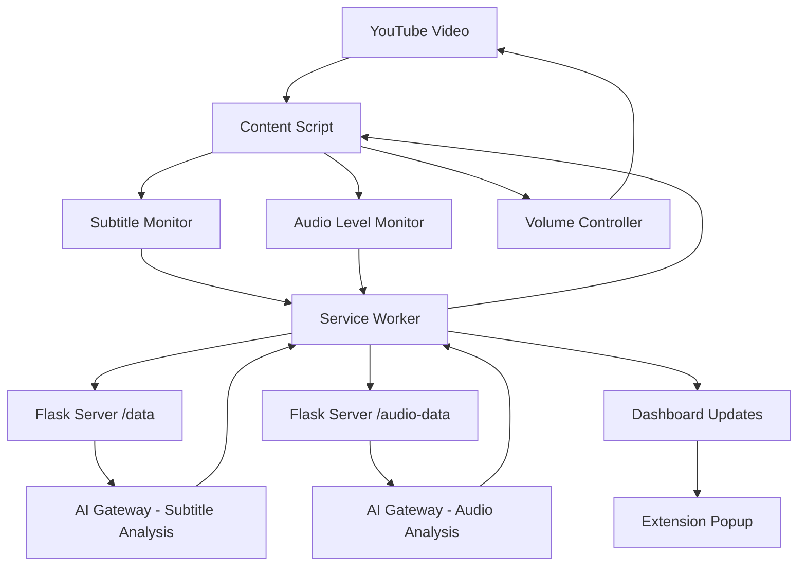

# Design Document: Volume Normalization Enhancement

## Overview

This design enhances Project Crest's volume normalization system by adding reactive live audio analysis alongside the existing subtitle-based detection. The system will use a dual-detection approach: proactive subtitle analysis (already working) and reactive audio level monitoring to catch loud events that subtitles miss or when subtitles aren't available. 

## Architecture



### Dual Detection Strategy
1. **Proactive Detection**: Subtitle monitoring (existing, working)
2. **Reactive Detection**: Real-time audio level analysis (new enhancement)
3. **Intelligent Fusion**: Combine both signals for optimal response

## Components and Interfaces

### Enhanced Content Script

#### Audio Level Monitor (New Component)
```javascript
class AudioLevelMonitor {
    constructor() {
        this.audioContext = null;
        this.analyser = null;
        this.baseline = 0.1;
        this.spikeThreshold = 0.3;
        this.isMonitoring = false;
    }
    
    startMonitoring(videoElement) {
        // Create audio context and analyser
        // Monitor real-time audio levels
        // Detect volume spikes above baseline
    }
    
    detectVolumeSpike(currentLevel) {
        // Calculate spike relative to baseline
        // Send to server if spike exceeds threshold
    }
}
```

#### Enhanced Volume Controller
```javascript
class VolumeController {
    constructor() {
        this.isAdjusting = false;
        this.currentReduction = 0;
        this.transitionDuration = 500;
    }
    
    applyVolumeReduction(level, duration, confidence) {
        // Smooth volume transitions
        // Handle overlapping adjustments
        // Apply confidence-based partial reductions
    }
    
    restoreVolume() {
        // Gradual volume restoration
        // Prevent jarring transitions
    }
}
```

### Enhanced Flask Server

#### Audio Analysis Endpoint (Enhanced)
```python
@app.route('/audio-data', methods=['POST'])
def handle_audio_data():
    """Process real-time audio analysis with AI enhancement"""
    data = request.get_json()
    volume = data.get('volume', 0)
    baseline = data.get('baseline', 0)
    spike = data.get('spike', 0)
    
    # AI-enhanced audio analysis
    ai_decision = analyze_audio_with_ai(volume, baseline, spike)
    
    # Determine response confidence
    confidence = calculate_audio_confidence(spike, ai_decision)
    
    if ai_decision == 'YES':
        return jsonify({
            "action": "LOWER_VOLUME",
            "level": calculate_reduction_level(confidence),
            "duration": calculate_duration(spike),
            "confidence": confidence,
            "trigger": "audio_analysis"
        })
```

#### Request Caching System
```python
class DecisionCache:
    def __init__(self):
        self.cache = {}
        self.cache_duration = 30  # seconds
    
    def get_cached_decision(self, text_hash):
        # Return cached AI decision if recent
        pass
    
    def cache_decision(self, text_hash, decision):
        # Store decision with timestamp
        pass
```

## Data Models

### Audio Analysis Data
```json
{
    "volume": 0.75,
    "baseline": 0.15,
    "spike": 0.45,
    "timestamp": "2023-10-27T10:00:00Z",
    "video_id": "dQw4w9WgXcQ",
    "analysis_type": "real_time_audio"
}
```

### Enhanced Volume Command
```json
{
    "action": "LOWER_VOLUME",
    "level": 0.25,
    "duration": 3000,
    "confidence": 0.85,
    "trigger": "audio_analysis",
    "transition_type": "smooth",
    "audio_data": {
        "current_volume": 0.75,
        "baseline": 0.15,
        "spike": 0.45
    }
}
```

### Dashboard Event Data
```json
{
    "event_type": "volume_adjustment",
    "timestamp": "2023-10-27T10:00:00Z",
    "trigger": "audio_analysis",
    "confidence": 0.85,
    "action_taken": "LOWER_VOLUME",
    "ai_reasoning": "High volume spike detected (0.45 above baseline 0.15)",
    "user_correction": false
}
```

## Enhanced Audio Detection Algorithm

### Real-time Audio Monitoring
```javascript
function monitorAudioLevels() {
    const video = document.querySelector('video');
    const audioContext = new AudioContext();
    const source = audioContext.createMediaElementSource(video);
    const analyser = audioContext.createAnalyser();
    
    source.connect(analyser);
    analyser.connect(audioContext.destination);
    
    const bufferLength = analyser.frequencyBinCount;
    const dataArray = new Uint8Array(bufferLength);
    
    function analyze() {
        analyser.getByteFrequencyData(dataArray);
        
        // Calculate RMS volume
        const rms = calculateRMS(dataArray);
        
        // Update baseline (rolling average)
        updateBaseline(rms);
        
        // Detect spikes
        const spike = rms - baseline;
        if (spike > spikeThreshold) {
            sendAudioData(rms, baseline, spike);
        }
        
        requestAnimationFrame(analyze);
    }
    
    analyze();
}
```

### AI-Enhanced Audio Analysis
```python
def analyze_audio_with_ai(volume, baseline, spike):
    """Enhanced audio analysis using AI + heuristics"""
    
    # Quick heuristic check for obvious cases
    if spike > 0.5:  # Very large spike
        return 'YES'
    elif spike < 0.1:  # Minimal spike
        return 'NO'
    
    # Use AI for borderline cases
    client = get_truefoundry_client()
    if client:
        prompt = f"""Analyze this real-time audio data:
        Current Volume: {volume:.3f}
        Baseline Volume: {baseline:.3f}
        Volume Spike: {spike:.3f}
        
        Context: This is from YouTube video audio analysis. 
        Spikes > 0.3 often indicate sudden loud sounds.
        Consider the relative change, not just absolute values.
        
        Should volume be lowered? YES or NO only."""
        
        response = client.chat.completions.create(
            model="openai-main/gpt-4o-mini",
            messages=[{"role": "user", "content": prompt}],
            max_tokens=5,
            temperature=0.1
        )
        
        return response.choices[0].message.content.strip().upper()
    
    # Fallback heuristic
    return 'YES' if spike > 0.25 else 'NO'
```

## Dashboard Enhancement Design

### Real-time Activity Feed
```javascript
class DashboardManager {
    constructor() {
        this.events = [];
        this.stats = {
            totalAdjustments: 0,
            accuracyRate: 0,
            userCorrections: 0
        };
    }
    
    logEvent(eventData) {
        this.events.unshift(eventData);
        this.updateStats();
        this.refreshDisplay();
    }
    
    updateStats() {
        // Calculate accuracy based on user corrections
        // Update real-time metrics
    }
}
```

### Enhanced Popup Interface
- **Live Status Indicator**: Shows current monitoring state
- **Detection Metrics**: Subtitle vs Audio detection counts
- **Confidence Levels**: AI decision confidence visualization
- **User Feedback**: Easy correction buttons for learning

## Error Handling

### Audio Context Limitations
- **Autoplay Policy**: Handle browser autoplay restrictions
- **CORS Issues**: Manage cross-origin audio access
- **Performance Impact**: Throttle analysis to prevent lag

### Network Resilience
- **Offline Mode**: Local heuristic fallback when server unavailable
- **Request Queuing**: Handle rapid-fire audio events
- **Timeout Handling**: Fast local decisions when AI is slow

## Performance Optimizations

### Audio Processing
- **Throttled Analysis**: Limit audio analysis to 10Hz to reduce CPU usage
- **Smart Baseline**: Adaptive baseline calculation for different content types
- **Efficient FFT**: Use optimized frequency analysis for spike detection

### Caching Strategy
- **Decision Cache**: Cache AI decisions for identical inputs (30s TTL)
- **Baseline Cache**: Store per-video baseline values
- **Request Deduplication**: Prevent duplicate simultaneous requests

## Testing Strategy

### Audio Detection Testing
1. **Synthetic Audio**: Generate test audio with known loud events
2. **Real Content**: Test with action movies, gaming videos, music
3. **Edge Cases**: Very quiet content, constant loud content, rapid changes

### Integration Testing
1. **Dual Detection**: Verify subtitle + audio detection coordination
2. **Dashboard Updates**: Confirm real-time data flow to popup
3. **Performance**: Measure response times and CPU usage

### User Experience Testing
1. **Smoothness**: Verify gradual volume transitions
2. **Responsiveness**: Measure detection-to-action latency
3. **Accuracy**: Track false positives/negatives with user feedback